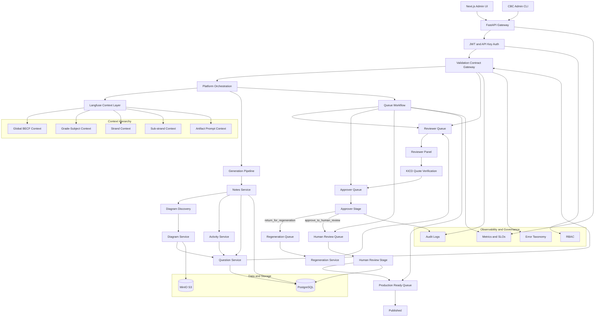

# CBC Architecture V2

This diagram reflects the implementation-ready architecture with explicit validation boundaries, reviewer and approver stages, regeneration loop, and publish transitions.

## Notes

- Approved is not final publish state.
- Publish requires human review transition to production-ready.
- Validation occurs both at API ingress and artifact egress.
- Question service is separate from note service and enforces mixed assessment output.
